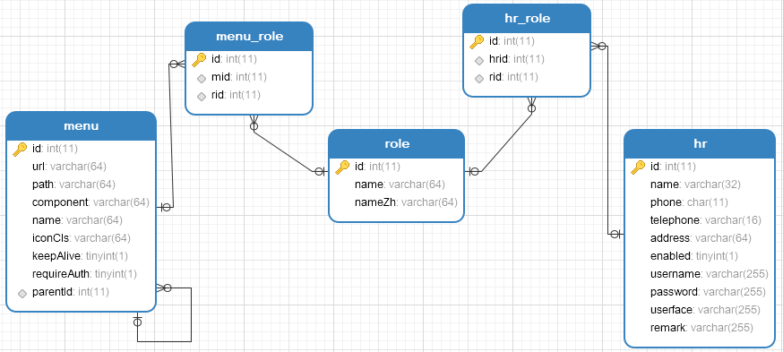
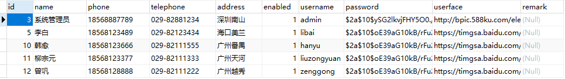

# 01.权限数据库设计

权限数据库主要包含了五张表，分别是资源表、角色表、用户表、资源角色表、用户角色表，数据库关系模型如下：

关于这个表，我说如下几点：

1. hr 表是用户表，存放了用户的基本信息。

2. role 是角色表，name字段表示角色的英文名称，按照 SpringSecurity 的规范，将以 `ROLE_` 开始，nameZh 字段表示角色的中文名称。

3. menu 表是一个资源表，该表涉及到的字段有点多，由于我的前端采用了 Vue 来做，因此当用户登录成功之后，系统将根据用户的角色动态加载需要的模块，所有模块的信息将保存在 menu 表中，menu 表中的 path、component、iconCls、keepAlive、requireAuth 等字段都是 Vue-Router 中需要的字段，也就是说 menu 中的数据到时候会以 json 的形式返回给前端，再由 vue 动态更新 router，menu 中还有一个字段 url，表示一个 url pattern，即路径匹配规则，假设有一个路径匹配规则为 `/admin/**`,那么当用户在客户端发起一个 `/admin/user` 的请求，将被 `/admin/**` 拦截到，系统再去查看这个规则对应的角色是哪些，然后再去查看该用户是否具备相应的角色，进而判断该请求是否合法。

下图分别是用户表、角色表以及资源表中的部分数据(数据库脚本可以在文末的项目地址中下载，位置[resources/vhr.sql](https://github.com/lenve/vhr/blob/master/hrserver/src/main/resources/vhr.sql))：

> 原文链接：https://vhr.javaboy.org/2020/0201/vhr-01