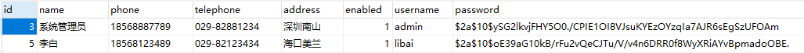

# 04.密码加密并加盐

密码要加盐处理，这是常识。各个权限处理框架对此都有不同程度的支持，Shiro、SpringSecurity 都有自家的解决方案，SpringSecurity 中有一个升级版的消息摘要：

BCryptPasswordEncoder

使用 BCryptPasswordEncoder，即使相同的明文，生成的新的加密字符串都是不一样的，这样可以避免像在 Shiro 中那样我们自己配置密码的盐，SpringSecurity 中使用 BCryptPasswordEncoder 的具体流程如下：

### 4.1 注册处理

在用户注册时，我们需要对密码进行处理，处理方式如下：

```java
public int hrReg(String username, String password) {
    //如果用户名存在，返回错误
    if (hrMapper.loadUserByUsername(username) != null) {
        return -1;
    }
    BCryptPasswordEncoder encoder = new BCryptPasswordEncoder();
    String encode = encoder.encode(password);
    return hrMapper.hrReg(username, encode);
}
```
通过 BCryptPasswordEncoder 中的 encode 方法对密码进行处理。

当用户注册成功之后，存在数据库中的密码就像下面这样：



### 4.2 登录处理

密码加密处理之后，登录时候也要对密码进行处理，修改 WebSecurityConfig 类的 configure(AuthenticationManagerBuilder auth) 方法，改为下面这样即可：

```java
@Override
protected void configure(AuthenticationManagerBuilder auth) throws Exception {
    auth.userDetailsService(hrService).passwordEncoder(new BCryptPasswordEncoder());
}
```

