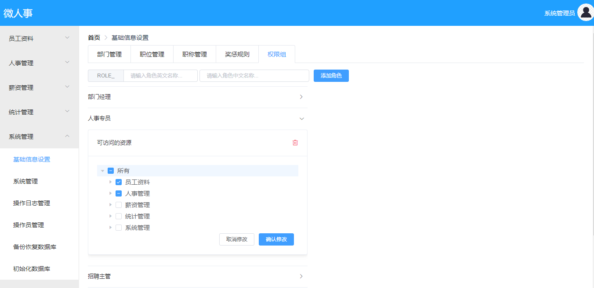

# 10.角色资源关系管理

这个主要是给不同角色分配不同的资源。

### 10.1 角色展示

角色的展示采用了 ElementUI 中的 **Collapse 折叠面板** ，并且采用了手风琴模式，即一次只打开一个角色，如下图：



角色中资源的展示则采用了 ElementUI 中的树形控件，管理员可以直接直接点击勾选，然后点击修改按钮，进行资源的分配。

### 10.2 核心思路

核心代码如下：

```html
<el-collapse v-model="activeColItem" accordion style="width: 500px;" @change="collapseChange">
<el-collapse-item v-for="(item,index) in roles" :title="item.nameZh" :name="item.id" :key="item.name">
    <el-card class="box-card">
    <div slot="header">
        <span>可访问的资源</span>
        <el-button type="text"
                    style="color: #f6061b;margin: 0px;float: right; padding: 3px 0;width: 15px;height:15px"
                    icon="el-icon-delete" @click="deleteRole(item.id,item.nameZh)"></el-button>
    </div>
    <div>
        <el-tree :props="props"
                :key="item.id"
                :data="treeData"
                :default-checked-keys="checkedKeys"
                node-key="id"
                ref="tree"
                show-checkbox
                highlight-current
                @check-change="handleCheckChange">
        </el-tree>
    </div>
    <div style="display: flex;justify-content: flex-end;margin-right: 10px">
        <el-button size="mini" @click="cancelUpdateRoleMenu">取消修改</el-button>
        <el-button type="primary" size="mini" @click="updateRoleMenu(index)">确认修改</el-button>
    </div>
    </el-card>
</el-collapse-item>
</el-collapse>
```

核心思路如下：

1. 通过 for 循环渲染出 el-collapse-item，将角色展示出来。

2. el-collapse-item 的内容就是一个树形控件，很明显，树形控件的数量和el-collapse-item 的数量是一样多的，但是考虑到 el-collapse-item 使用了手风琴模式，即一次只有一个折叠面板被打开，因此树形控件的数据源只有一个，即多个树形控件共用一个数据源，为了避免数据紊乱，我采取了这样的数据加载方式：当用户每次点击折叠面板的时候，我都根据当前折叠面板所对应的角色去查询该角色所对应的资源，同时也查询所有的资源，将查到的数据交给树形控件去展示。这样可以避免为每一个树形控件都准备一份数据。

