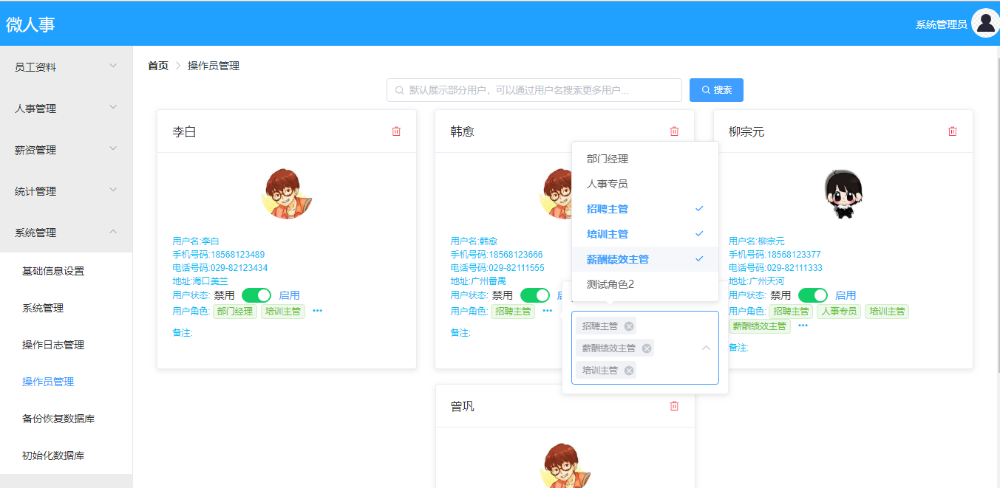

# 11.用户角色关系管理

这个就是常规的增删改查。

### 11.1 用户展示

用户的展示使用了 ElementUI 的 **Card 卡片**  来实现。效果图如下：

### 11.2 角色展示

角色展示使用了ElementUI的 **Tag 标签**  来实现，角色后面有一个 more 按钮，点击之后是一个 **Popover 弹出框** ，**Popover 弹出框** 的里边是一个 **Select 选择器** ，多选的，可以进行角色的分配。

> 原文链接：https://vhr.javaboy.org/2020/0211/vhr-11