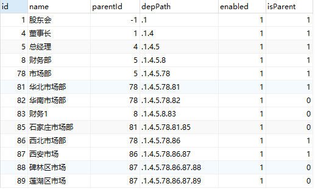

# 12.部门数据库设计与存储过程编写

部门数据库整体来说还是比较简单，如下：



都是常规字段，脚本可以在[项目中](https://github.com/lenve/vhr/blob/master/hrserver/src/main/resources/vhr.sql)下载。depPath 是为了查询方便，isParent 表示该条是否是父部门。为了简化程序中的逻辑，depPath 的设置和 isParent 的设置我都在存储过程中完成。

### 12.1 添加部门存储过程

添加部门存储过程如下：

```sql
DELIMITER $$

USE `vhr`$$

DROP PROCEDURE IF EXISTS `addDep`$$

CREATE DEFINER=`root`@`localhost` PROCEDURE `addDep`(in depName varchar(32),in parentId int,in enabled boolean,out result int,out result2 int)
begin
  declare did int;
  declare pDepPath varchar(64);
  insert into department set name=depName,parentId=parentId,enabled=enabled;
  select row_count() into result;
  select last_insert_id() into did;
  set result2=did;
  select depPath into pDepPath from department where id=parentId;
  update department set depPath=concat(pDepPath,'.',did) where id=did;
  update department set isParent=true where id=parentId;
end$$

DELIMITER ;
```

关于这个存储过程，我说如下几点：

1. 该存储过程接收五个参数，三个输入参数分别是部门名称、父部门 Id，该部门是否启用，两个输出参数分别表示受影响的行数和插入成功后 id 的值。

2. 存储过程首先执行插入操作，插入完成后，将受影响行数赋值给 result。

3. 然后通过 `last_insert_id()` 获取刚刚插入的 id，赋给 result2。

4. 接下来查询父部门的 depPath，并且和刚刚生成的id组合后作为刚刚插入部门的 depPath。

5. 将父部门的 isParent 字段更新为 true。

将这些逻辑写在存储过程中，可以简化我们代码中的逻辑。

### 12.2 删除部门存储过程

删除部门也被我写成了存储过程，主要是因为删除过程也要做好几件事，核心代码如下：

```sql
DELIMITER $$

USE `vhr`$$

DROP PROCEDURE IF EXISTS `deleteDep`$$

CREATE DEFINER=`root`@`localhost` PROCEDURE `deleteDep`(in did int,out result int)
begin
  declare ecount int;
  declare pid int;
  declare pcount int;
  select count(*) into ecount from employee where departmentId=did;
  if ecount>0 then set result=-1;
  else
  select parentId into pid from department where id=did;
  delete from department where id=did and isParent=false;
  select row_count() into result;
  select count(*) into pcount from department where parentId=pid;
  if pcount=0 then update department set isParent=false where id=pid;
  end if;
  end if;
end$$

DELIMITER ;
```

关于这个存储过程，我说如下几点：

1. 一个输入参数表示要删除数据的 id，一个输出参数表示删除结果。

2. 如果该部门下有员工，则该部门不能被删除。

3. 删除该部门时注意加上条件 isParent=false，即父部门不能被删除，这一点我在前端已经做了判断，正常情况下父部门的删除请求不会被发送，但是考虑到前端的数据不能被信任，所以后台我们也要限制。

4. 删除成功之后，查询删除部门的父部门是否还有其他子部门，如果没有，则将父部门的 isParent 修改为 false。

> 原文链接：https://vhr.javaboy.org/2020/0212/vhr-12