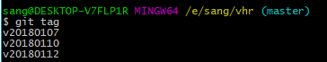
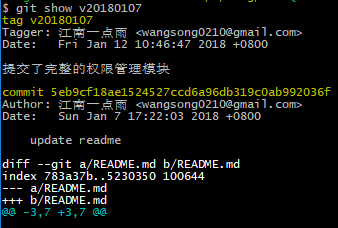
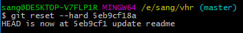

# 17.[题外话]利用git标签回退至任意版本

由于本项目在不停的更新，小伙伴们的需求不尽相同，有的小伙伴可能只需要看权限管理模块，有的小伙伴需要看部门管理等等。因此，我现在给每一次的提交都打了 tag，下面我简单介绍下 tag 的用法。

当小伙伴从 GitHub 上将项目克隆下来之后，可以通过 `git tag` 命令来查看当前有哪些 tag，如下：

tag 的版本号就是提交的日期，小伙伴可以根据 readme 文档中的更新记录来确定你想回到哪一个版本中，比如我想退回到 v20180107 这个版本去，此时通过 `git show v20180107` 命令来查看对应的版本号，如下：

commit 后面的就是对应的提交版本号，然后通过 `git reset --hard 5eb9cf18a` 命令即可回到只有权限管理模块的时代。如下：

以上命令可以帮助小伙伴在任意版本之间跳跃。

> 原文链接：https://vhr.javaboy.org/2020/0217/vhr-17