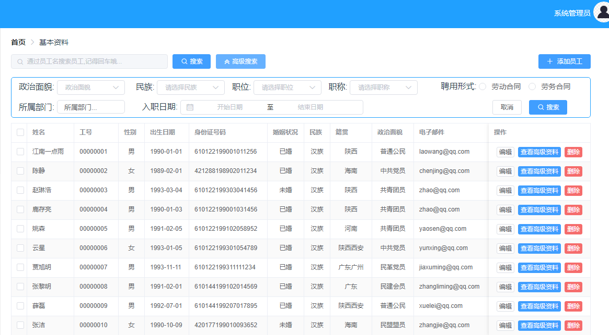

# 20.高级搜索功能介绍

上个版本我们已经完成了基本的搜索功能，可以通过员工姓名进行搜索，为了使搜索条件更丰富，我增加了高级搜索功能，架子已经搭建好了，小伙伴如果觉得高级搜索的条件还是不够，想要继续增加，直接增加条件即可，当然添加了新的搜索条件之后，前后端要同时更新。

效果图如下：

需要注意的是高级搜索和普通搜索不可以同时使用。另外当用户关闭高级搜索框后，高级搜索条件会自动清空。

> 原文链接：https://vhr.javaboy.org/2020/0220/vhr-20