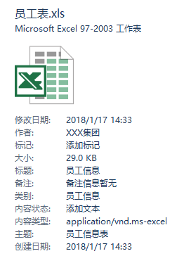

# 23.POI生成Excel

整体来说，Excel有 `.xls` 和 `.xlsx` ，那么在 POI 中这两个也对应两个不同的类，但是类名不同，方法基本都是一致的，因此我这里将只介绍 `.xls` 一种。

整体来说，可以分为如下七个步骤：

1. 创建 Excel 文档

```java
HSSFWorkbook workbook = new HSSFWorkbook();
```

1. 设置文档的基本信息(可选)

```java
//获取文档信息，并配置
DocumentSummaryInformation dsi = workbook.getDocumentSummaryInformation();
//文档类别
dsi.setCategory("员工信息");
//设置文档管理员
dsi.setManager("江南一点雨");
//设置组织机构
dsi.setCompany("XXX集团");
//获取摘要信息并配置
SummaryInformation si = workbook.getSummaryInformation();
//设置文档主题
si.setSubject("员工信息表");
//设置文档标题
si.setTitle("员工信息");
//设置文档作者
si.setAuthor("XXX集团");
//设置文档备注
si.setComments("备注信息暂无");
```

这些信息将显示在详细信息窗格中：



1. 创建一个 Excel 表单,参数为 sheet 的名字

```java
HSSFSheet sheet = workbook.createSheet("XXX集团员工信息表");
```

1. 创建一行

```java
HSSFRow headerRow = sheet.createRow(0);
```

0 表示第一行。

1. 在第一行中创建第一个单元格，并设置数据

```java
HSSFCell cell0 = headerRow.createCell(0);
cell0.setCellValue("编号");
```

1. 将 Excel 写到 ByteArrayOutputStream 中

```java
baos = new ByteArrayOutputStream();
workbook.write(baos);
```

1. 创建 ResponseEntity 并返回

```java
return new ResponseEntity<byte[]>(baos.toByteArray(), headers, HttpStatus.CREATED);
```

核心步骤就这七个步骤，当然还有其他设置单元格数据格式、单元格背景、单元格宽度等，大家可以在源码中研究，这里就不赘述了。

