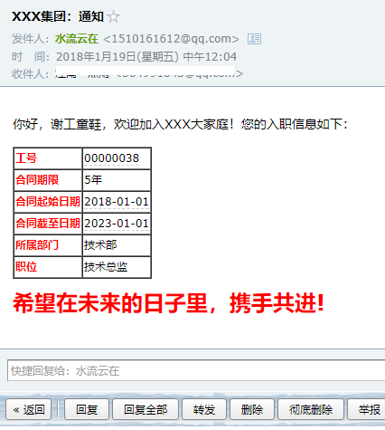

# 26.SpringBoot中使用Freemarker邮件模板生成邮件

当邮件内容比较简单的时候，我们可能一行字符串就能表达所有意思了，但是大部分情况下，我们的邮件内容都比较复杂需要用 HTML 来组织邮件内容，而且 HTML 中的数据还要动态修改，这时，最好的解决方案莫过于 Freemarker 了。

有的小伙伴看到 Freemarker 就疑惑了，你不是号称前后端分离么，怎么还用上 Freemarker 了？freemarker 使用的最多的场景就是做页面模板，但是它不仅可以做 HTML 模板(大部分情况下它都扮演了这个角色)，还可以做 XML、邮件等的模板，本文我们就来看看作为邮件模板，Freemarker 要怎么使用。

### 26.1 引入依赖

第一步当然是引入 freemarker 依赖了，如下：

```xml
<dependency>
    <groupId>org.freemarker</groupId>
    <artifactId>freemarker</artifactId>
</dependency>
```

### 26.2 创建邮件模板

接下来就是根据我们想要的 HTML 样式，创建一个邮件模板,这个模板是一个 ftl 文件，如下：

```html
<p>你好，${name}童鞋，欢迎加入XXX大家庭！您的入职信息如下：</p>
<table border="1" cellspacing="0">
    <tr><td><strong style="color: #F00">工号</strong></td><td>${workID}</td></tr>
    <tr><td><strong style="color: #F00">合同期限</strong></td><td>${contractTerm}年</td></tr>
    <tr><td><strong style="color: #F00">合同起始日期</strong></td><td>${beginContract?string("yyyy-MM-dd")}</td></tr>
    <tr><td><strong style="color: #F00">合同截至日期</strong></td><td>${endContract?string("yyyy-MM-dd")}</td></tr>
    <tr><td><strong style="color: #F00">所属部门</strong></td><td>${departmentName}</td></tr>
    <tr><td><strong style="color: #F00">职位</strong></td><td>${posName}</td></tr>
</table>
<p><strong style="color: #F00; font-size: 24px;">希望在未来的日子里，携手共进!</strong></p>
```

最终的显示效果如下：



这个样式小伙伴可以根据自己的需求灵活调整。有一个要注意的地方： **因为我已经前后端分离了，因此项目中的 webapp 目录对我来说已经无关紧要了，创建的意义不大了，因此这个邮件模板我把它放在 resources 目录下的 ftl 目录下。**

### 26.3 模板解析

有了模板，接下来我只需要向模板中传入数据，并将模板 ftl 解析为 html 即可，如下：

```java
Configuration cfg = new Configuration(Configuration.VERSION_2_3_27);
cfg.setClassLoaderForTemplateLoading(ClassLoader.getSystemClassLoader(),"ftl");
Template emailTemplate = cfg.getTemplate("email.ftl");
StringWriter out = new StringWriter();
emailTemplate.process(employee,out);
```

不像在 SSM 框架中配置 freemarker 样麻烦，这里就几行代码：

1. 根据所使用的 freemarker 版本号创建一个 Configuration 对象

2. 设置模板路径，模板路径的设置方法有好几个，我这里因为放在了 resources 目录下，因此使用了 setClassLoaderForTemplateLoading 方法

3. 创建模板，通过 process 方法进行渲染，渲染后的 html 将放到 out 这个变量中，然后我们在邮件中直接将之发送出去即可。

OK，经过以上步骤，我们就顺利的生成了一封邮件。

