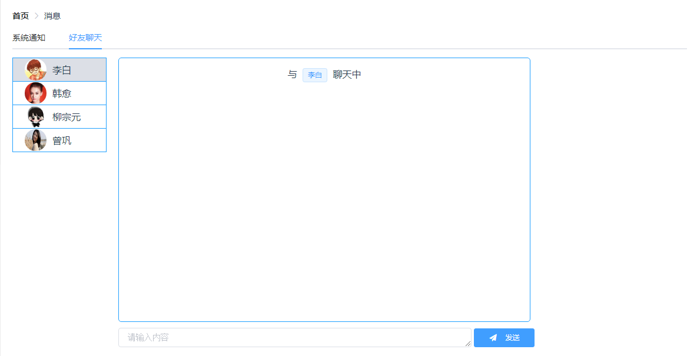
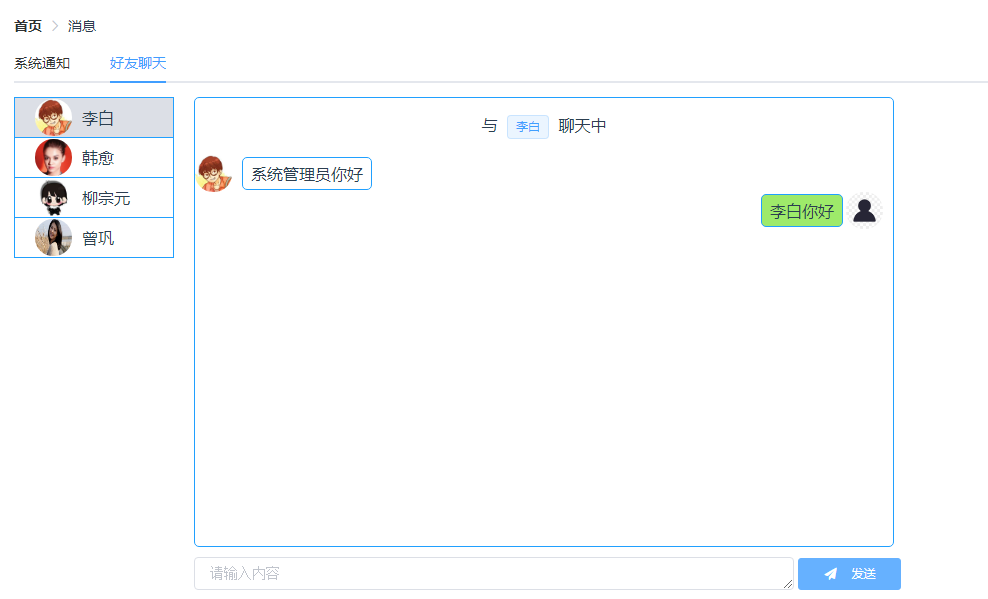
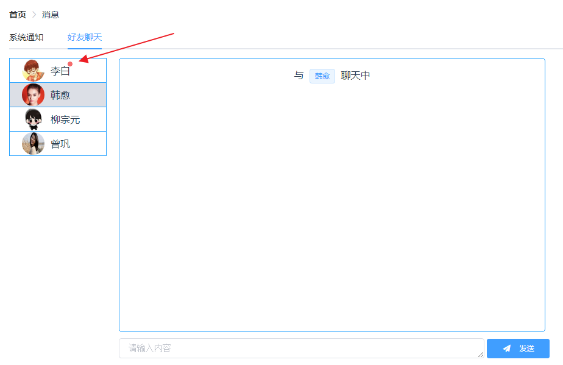
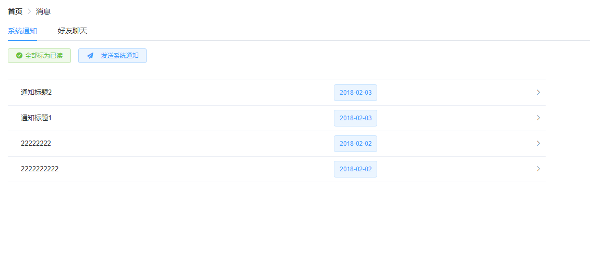
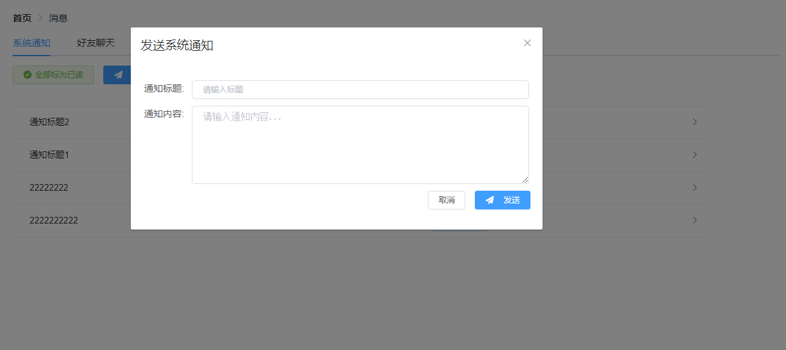
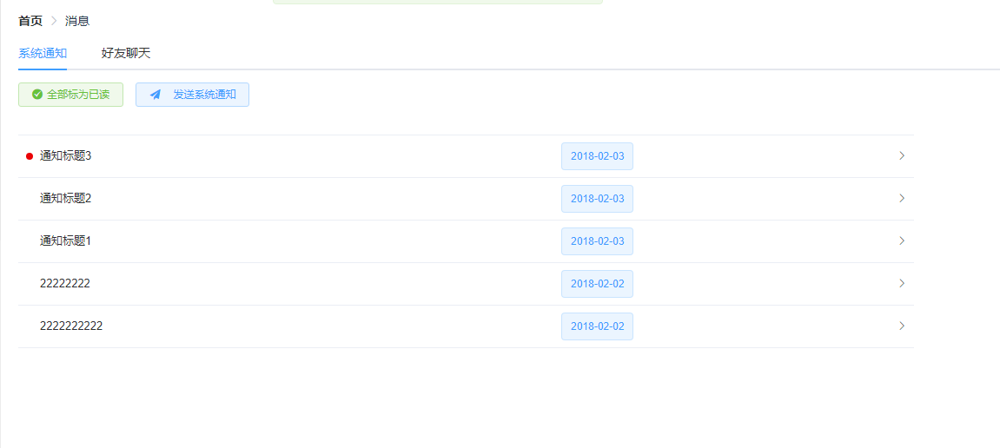

# 31.在线聊天功能介绍

在线聊天功能是为了方便HR快速交流，由于 HR 人数有限，因此这里并未考虑高并发问题，小伙伴思考问题一定要结合上下文环境。OK，我们先来看看效果图：

### 31.1 在线聊天效果图

登陆成功后，点击右上角的闹铃图标，进入到消息页面，点击 **好友聊天**  选项卡，效果如下：

此时换个浏览器，或者使用 chrome 中的多用户模式再打开一个浏览器，以另外一个用户身份登录，开始进行聊天，聊天页面如下：

如果系统管理员正在和韩愈聊天，此时李白发来的消息，则李白的姓名旁会有提示：

### 31.2 系统消息效果图

只有管理员具备发送系统消息的权限，管理员的系统消息页面如下：

普通 HR 的系统消息页面没有发送按钮，发送系统消息页面如下：

消息发送成功之后，会有红点提示未读消息，如下：

OK，大致效果就是这样，功能还不是很完善，后期有时间再进行修补。

