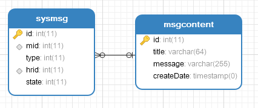

# 33.系统通知功能实现

不同于在线聊天，系统通知会在服务端进行保存。服务端数据库设计如下：



msgcontent表用来保存每一条系统通知，sysmsg表则用来记录每一个用户和每一条通知的关系，比如该用户是否阅读了该条通知。

系统通知的整个处理流程是这样的：

1. 用户登录成功来到 Home 页面后，会主动发起一次请求，查看是否有未读通知，如果有，则页面右上角的闹铃按钮会有相关提示

2. 管理员发送了系统通知之后，会由 websocket 主动推送一条消息，告诉当前登录用户有新通知

3. 用户打开系统通知页面后，未读通知会有红点提示，打开该通知后，该通知就变为已读通知

4. 通知的发送则是先由前端发起请求，向数据库中添加一条记录，添加成功后，再发送一条群发通知的请求

接下来我们来看看一个大致的实现步骤。

### 33.1 服务端

由于只有管理员才可以发送系统通知，我这里在 SysMsgService 的相关方法上添加了如下注解：

```java
@PreAuthorize("hasRole('ROLE_admin')")//只有管理员可以发送系统消息
public boolean sendMsg(MsgContent msg) {
    int result = sysMsgMapper.sendMsg(msg);
    List<Hr> allHr = hrService.getAllHr();
    int result2 = sysMsgMapper.addMsg2AllHr(allHr, msg.getId());
    return result2==allHr.size();
}
```

数据库添加数据的代码我就不贴出来了，小伙伴 star 项目自己研究。服务端另外一个核心就是添加一个群发 websocket 消息的方法在 WsController 中，如下：

```java
@MessageMapping("/ws/nf")
@SendTo("/topic/nf")
public String handleNF() {
    return "系统消息";
}
```

一会当数据库的消息添加成功之后，前端向 `/ws/nf` 发送消息，前端订阅 `/topic/nf` 的消息。

后端核心主要就是这两块。

### 33.2 前端

前端还是在 store 中，websocket 消息连接成功之后，多订阅一个消息，就是来自 `/topic/nf` 的消息，如下：

```javascript
connect(context){
    context.state.stomp = Stomp.over(new SockJS("/ws/endpointChat"));
    context.state.stomp.connect({}, frame=> {
    context.state.stomp.subscribe("/user/queue/chat", message=> {
        //...
    });
    //多订阅一个消息
    context.state.stomp.subscribe("/topic/nf", message=> {
        context.commit('toggleNFDot', true);
    });
    }, failedMsg=> {

    });
}
```

当收到服务端推送来的消息后，将闹铃按钮上的红点显示出来。

前端发送系统消息的代码如下：

```javascript
sendNFMsg(){
this.dialogLoading = true;
var _this = this;
this.postRequest("/chat/nf", {message: this.message, title: this.title}).then(resp=> {
    _this.dialogLoading = false;
    if (resp && resp.status == 200) {
    var data = resp.data;
    _this.$message({type: data.status, message: data.msg});
    if (data.status == 'success') {
        _this.$store.state.stomp.send("/ws/nf", {}, '');
        _this.initSysMsgs();
        _this.cancelSend();
    }
    }
})
}
```

首先发送 `/chat/nf` 请求，数据添加成功后，再由客户端发起一条 ws 消息，将以便通知其他 HR 有新消息。

好了，大致的核心流程就是这样，详细代码小伙伴可以 star 项目进行研究。

