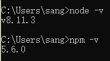
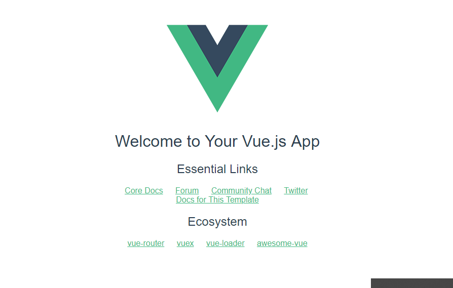
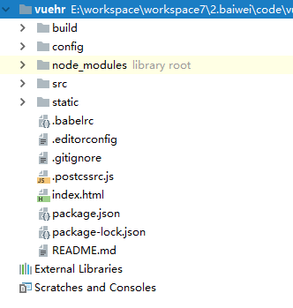
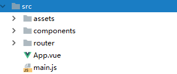
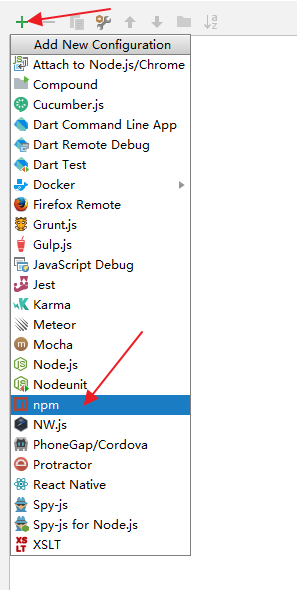
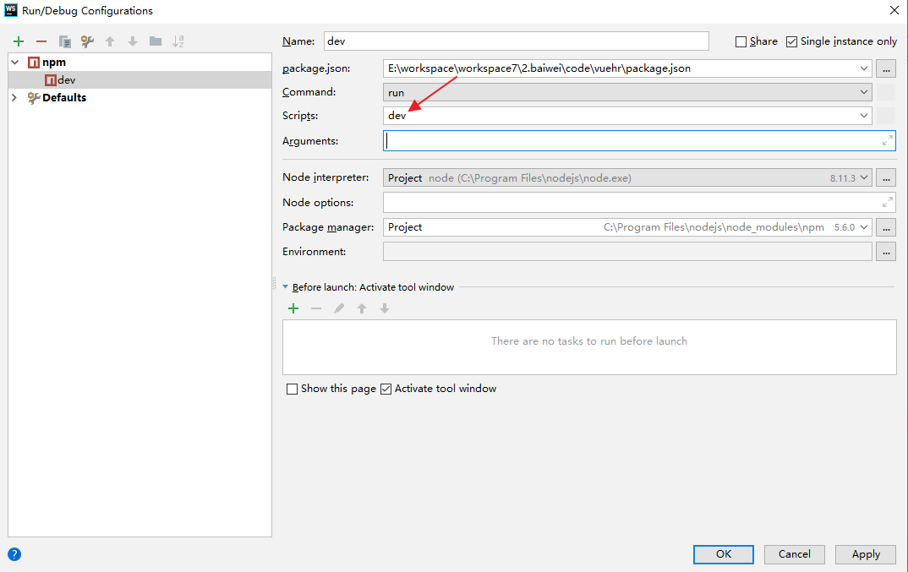
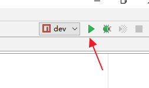

# 51.前后端分离以及Vue.js入门



> 原文链接：https://vhr.javaboy.org/2020/0421/vhr-51



松哥的书里边，其实有涉及åˆ?Vue，但是并没有详细说过，原因很简单，Vue 的资料都是中文的，把 Vue.js 官网的资料从头到尾浏览一遍该懂的基本就懂了，个人感觉这个是最好的 Vue.js 学习资料 ，因此在我的书里边就没有多说。但是最近总结小伙伴遇到的问题，感觉很多人对前后端分离开发还是两眼一抹黑，所以今天松哥想和大家聊一下前后端分离以及 Vue.js 的一点事，算是一个简单的入门科普吧ã€?

### 51.1 前后端不åˆ?

1. 后端模板：Jsp、FreeMarker、Velocity



2. 前端模板：Thymeleaf



前后端不分，Jsp 是一个非常典型写法，Jsp å°?HTML å’?Java 代码结合在一起，刚开始的时候，确实提高了生产力，但是时间久了，大伙就发çŽ?Jsp 存在的问题了，对于后端工程师来说，可能不太精é€?css ，所以流程一般是这样前端设计页面â€?后端把页面改造成 Jsp â€? 后端发现问题 â€? 页面给前ç«?â€? 前端不会Jsp。这种方式效率低下。特别是在移动互联网兴起后，公司的业务，一般除äº?PC 端，还有手机端、小程序等，通常，一套后台系统需要对应多个前端，此时就不可以继续使用前后端不分的开发方式了ã€?

在前后端不分的开发方式中，一般来说，后端可能返回一ä¸?ModelAndView ，渲染成 HTML 之后，浏览器当然可以展示，但是对于小程序、移动端来说，并不能很好的展ç¤?HTML（实际上移动端也支持HTML，只不过运行效率低下）。这种时候，后端和前端数据交互，主流方案就是通过 JSON 来实现ã€?

### 51.2 前后端分ç¦?

前后端分离后，后端不再写页面，只提供 JSON 数据接口（XML数据格式现在用的比较少），前端可以移动端、小程序、也可以æ˜?PC 端，前端负责 JSON 的展示，页面跳转等都是通过前端来实现的。前端后分离后，前端目前有三大主流框架：



- Vue



作者尤雨溪，Vue本身借鉴äº?Angular，目前GitHubstar数最多，建议后端工程师使用这个，最大的原因是Vue上手容易，可以快速学会，对于后端工程师来说，能快速搭建页面解决问题即可，但是如果你是专业的前端工程师，我会推荐你三个都去学习 。就目前国内前端框架使用情况来说，Vue 算是使用最多的。而且目前来说，有大量 Vue 相关的周边产品，各种 UI 框架，开源项目，学习资料非常多ã€?

- React



Facebook 的产品。是一个用于构建用户界面的 js 库，React 性能较好，代码逻辑简单ã€?

- Angular



AngularJS 是一款由 Google 维护的开æº?JavaScript 库，用来协助单一页面应用程序运行。它的目标是透过 MVC 模式（MVC）功能增强基于浏览器的应用，使开发和测试变得更加容易ã€?

### 51.3 Vue简ä»?

Vue (读音 /vjuː/，类似于 view) 是一套用于构建用户界面的渐进式框架。与其它大型框架不同的是，Vue 被设计为可以自底向上逐层应用。Vue 的核心库只关注视图层，不仅易于上手，还便于与第三方库或既有项目整合。另一方面，当与现代化的工具链以及各种支持类库结合使用时，Vue 也完全能够为复杂的单页应用提供驱动ã€?

1. 只关注视图层



2. MVVM 框架



大家在使ç”?jQuery 过程中，掺杂了大量的 DOM 操作，修改视图或者获å?value ，都需è¦?DOM 操作，MVVM 是一种视图和数据模型双向绑定的框架，即数据发生变化，视图会跟着变化，视图发生变化，数据模型也会跟着变化，开发者再也不需要操ä½?DOM 节点ã€?

如下一个简单的九九乘法表让大家感受一ä¸?MVVM ï¼?

```html

<!DOCTYPE html>

<html lang="en">

<head>

    <meta charset="UTF-8">

    <title>Title</title>

    <script src="https://cdn.jsdelivr.net/npm/vue/dist/vue.js"></script>

</head>

<body>

<div id="app">

    <input type="text" v-model="num">

    <table border="1">

        <tr v-for="i in parseInt(num)">

            <td v-for="j in i">*=</td>

        </tr>

    </table>

</div>

<script>

    var app = new Vue({

        el: "#app",

        data: {

            num:9

        }

    });

</script>

</body>

</html>

```



用户修改输入框中的数据，引起变量的变化，进而实现九九乘法表的更新ã€?

### 51.4 SPA



SPA（single page web application），单页面应用，是一种网络应用程序或网站的模型，它通过动态重写当前页面来与用户交互，而非传统的从服务器重新加载整个新页面。这种方法避免了页面之间切换打断用户体验，使应用程序更像一个桌面应用程序。在单页应用中，所有必要的代码ï¼?HTML、JavaScript å’?CSS ）都通过单个页面的加载而检索，或者根据需要（通常是为响应用户操作）动态装载适当的资源并添加到页面。SPA 有一个缺点，因为 SPA 应用部署后只æœ?个页面，而且这个页面只是一å ?js 、css 引用，没有其他有效价值，因此，SPA 应用不易被搜索引擎收录，所以，一般来说，SPA 适合做大型企业后台管理系统ã€?

Vue 使用方式大致上可以分为两大类ï¼?

1. 直接将Vue在页面中引入，不å?SPA 应用



2. SPA应用



### 51.5 基本环境搭建



首先需要安装两个东西：



1. NodeJS



2. npm



直接搜索下载 NodeJS 即可，安装成功之后，npm 也就有了。安装成功之后，可以 åœ?cmd 命令哈验证是否安装成功：







NodeJS 安装成功之后，接下来安装 Vue的工具：



```bash

npm install -g vue-cli # 只需要第一次安装时执行

vue init webpack my-project # 使用webpack模板创建一个vue项目

cd my-project #进入到项目目录中

npm install # 下载依赖（如果在项目创建的最后一步选择了自动执行npm install，则该步骤可以省略）

npm run dev # 启动项目

```



启动成功后，浏览器输å…?`http://localhost:8080` 就能看到如下页面ï¼?





**执行 `npm install` 命令时，默认使用的是国外的下载源 ，可以通过如下代码配置为使用淘宝的镜像ï¼?*



```bash

npm config set registry https://registry.npm.taobao.org

```



修改完成后，就能有效提高下载的成功率ã€?

### 51.6 Vue 项目结构介绍



Vue 项目创建完成后，使用 Web Storm 打开项目，项目目录如下：







1. build 文件夹，用来存放项目构建脚本



2. config 中存放项目的一些基本配置信息，最常用的就是端口转å?

3. node_modules 这个目录存放的是项目的所有依赖，å?npm install 命令下载下来的文ä»?

4. src 这个目录下存放项目的源码，即开发者写的代码放在这é‡?

5. static 用来存放静态资æº?

6. index.html 则是项目的首页，入口页，也是整个项目唯一的HTML页面



7. package.json 中定义了项目的所有依赖，包括开发时依赖和发布时依赖



对于开发者来说，以后 99.99% 的工作都是在 src 中完成的，src 中的文件目录如下ï¼?





1. assets 目录用来存放资产文件



2. components 目录用来存放组件（一些可复用，非独立的页面），当然开发者也可以åœ?components 中直接创建完整页面ã€?

3. 推荐åœ?components 中存放组件，另外单独新建一ä¸?page 文件夹，专门用来放完整页面ã€?

4. router 目录中，存放了路由的js文件



5. App.vue 是一个Vue组件，也是项目的第一个Vue组件



6. main.js相当于Java中的main方法，是整个项目的入口js



main.js 内容如下ï¼?

```javascript

import Vue from 'vue'

import App from './App'

import router from './router'

Vue.config.productionTip = false

/* eslint-disable no-new */

new Vue({

  el: '#app',

  router,

  components: { App },

  template: '<App/>'

})

```



1. 在main.js 中，首先导入 Vue 对象



2. 导入 App.vue ，并且命名为 App



3. 导入router，注意，由于router目录下路由默认文件名ä¸?index.js ，因此可以省ç•?

4. 所有东西都导入成功后，创建一个Vue对象，设置要被Vue处理的节点是 '#app'ï¼?#app' 指提前在index.html 文件中定义的一个div



5. å°?router 设置åˆ?vue 对象中，这里是一个简化的写法，完整的写法æ˜?router:router，如æž?key/value 一模一样，则可以简写ã€?

6. 声明一个组ä»?App，App 这个组件在一开始已经导入到项目中了，但是直接导入的组件无法直接使用，必须要声明ã€?

7. template 中定义了页面模板，即å°?App 组件中的内容渲染åˆ?'#app' 这个div 中ã€?

因此，可以猜测，项目启动成功后，看到的页面效果定义在 App.vue ä¸?

```html

<template>

  <div id="app">

    

    <router-view/>

  </div>

</template>

<script>

export default {

  name: 'App'

}

</script>

<style>

#app {

  font-family: 'Avenir', Helvetica, Arial, sans-serif;

  -webkit-font-smoothing: antialiased;

  -moz-osx-font-smoothing: grayscale;

  text-align: center;

  color: #2c3e50;

  margin-top: 60px;

}

</style>

```



1. App.vue 是一个vue组件，这个组件中包含三部分内容：1.页面模板（template）；2.页面脚本（script）；3.页面样式（styleï¼?

2. 页面模板中，定义了页面的 HTML 元素，这里定义了两个，一个是一张图片，另一个则是一ä¸?router-view



3. 页面脚本主要用来实现当前页面数据初始化、事件处理等等操ä½?

4. 页面样式就是针对 template ä¸?HTML 元素的页面美化操ä½?

需要额外解释的是，router-view，这个指展示路由页面的位置，可以简单理解为一个占位符，这个占位符展示的内容将根据当前具体çš?URL 地址来定。具体展示的内容，要参考路由表，即 router/index.js 文件，该文件如下ï¼?

```javascript

import Vue from 'vue'

import Router from 'vue-router'

import HelloWorld from '@/components/HelloWorld'

Vue.use(Router)

export default new Router({

  routes: [

    {

      path: '/',

      name: 'HelloWorld',

      component: HelloWorld

    }

  ]

})

```



1. 这个文件中，首先导入了Vue对象、Router对象以及 HelloWorld 组件ï¼?

2. 创建一个Router对象，并定义路由è¡?

3. 这里定义的路由表，pathä¸?`/` ，对应的组件ä¸?HelloWorld，即浏览器地址ä¸?`/` 时，在router-view位置显示 HelloWorld 组件



### 51.7 WebStorm 中启动Vue



也可以直接在 webstorm 中配置vue并启动，点击右上角进行配置：







然后配置一下脚æœ?ï¼?





配置完成后，点击右上角启动按钮，就可以启动一ä¸?Vue 项目，如下：







### 51.8 项目编译



这么大一个前端项目，肯定没法直接发布运行，当开发者完成项目开发后，将 cmd 命令行定位到当前项目目录，然后执行如下命令对项目进行打包ï¼?

```bash

npm run build

```



打包成功后，当前项目目录下会生成一ä¸?dist 文件夹，这个文件夹中有两个文件，分别æ˜?index.html å’?static ，index.html 页面就是我们 SPA 项目中唯一çš?HTML 页面了，static 中则保存了编译后çš?js、css等文件，项目发布时，可以使用 nginx 独立部署 dist 中的静态文件，也可以将静态文件拷贝到 Spring Boot 项目çš?static 目录下，然后å¯?Spring Boot 项目进行编译打包发布ã€?

### 51.9 总结



因为松哥的读者以后端程序猿居多，也有少量前端程序猿，因此本文松哥想从一个后端程序猿的角度来带大家理解一下前后端分离以及 Vue 的一些基本用法，也欢迎专业的前端工程师出来拍砖ã€