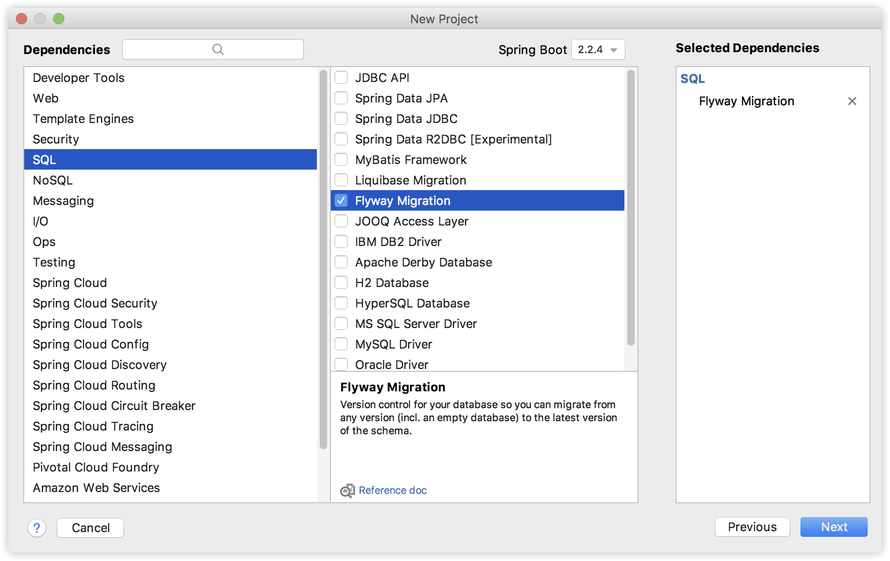
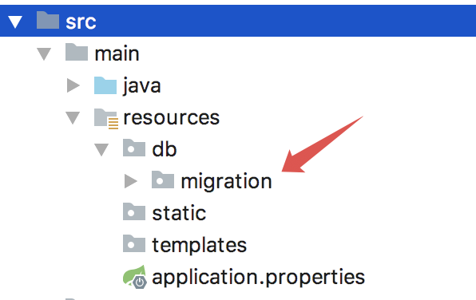
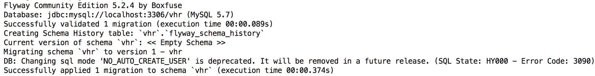
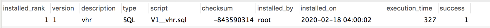

# 54.简化微人事部署，Flyway 搞起æ?

> 原文链接：https://vhr.javaboy.org/2020/0424/vhr-54



虽然我之前录了一个微人事部署视频（[新版微人事部署教程来啦](https://mp.weixin.qq.com/s/FoNVyAR1BkYfutFq9sjJNQ)），但是由于这次升级涉及到了 Redis å’?RabbitMQ，所以在本地跑微人事还是一件比较麻烦的事情，有的小伙伴甚至部署失败，所以我也一直在尝试简化部署步骤，这两天给项目加了 Flyway，数据库准备这块算是得到了一定程度简化ã€?

今天就和大家来大致说è¯?Flyway 的用法，以及如何在微人事中使ç”?Flywayã€?

### 54.1 什么是 Flyway



我们在公司做开发时，由于项目需求的变化，或者前期设计缺陷，导致在后期需要修改数据库，这应该是一个比较常见的事情，如果项目还没上线，你可能把表删除了重新创建，但是如果项目已经上线了，就不能这样简单粗暴了，我们需要通过 SQL 脚本在已有数据表的基础上进行升级ã€?

目前 Java 这块，想要对数据库的版本进行管理主要有两个工具：



- Flyway



- Liquibase



两个工具各有千秋，但是核心功能都是数据库的版本管理，这里主要来看 Flyway。就像我们使ç”?Git 来管理代码版本一样，Flyway 可以用来管理数据库版本ã€?

好了，接下来我们就来看看ç”?Flyway 如何简化微人事部署，然后再来说è¯?Flyway 的一个大致原理ã€?

### 54.2 嵌入到微人事



如果是在一个全新的项目中使ç”?Flyway，那么在新建一ä¸?Spring Boot 项目时，就有 Flyway 的选项，如下图ï¼?





项目创建成功后，resources 目录下也会多出来一ä¸?db/migration 目录，这个目录用来存放数据库脚本，如下：







**注意**



这个如果创建项目时就选择äº?Flyway 依赖，就会有这个目录。现在我要在已经做好的微人事中加å…?Flyway，这个目录就需要我手动创建了ã€?

首先在微人事中添åŠ?flyway 依赖ï¼?

```xml

<dependency>

    <groupId>org.flywaydb</groupId>

    <artifactId>flyway-core</artifactId>

</dependency>

```



然后åœ?vhr-web 模块下的 resources 目录下，手动创建 db/migration 目录，然后在该目录下创建数据库脚本，数据库脚本的命名方式如下ï¼?

- `V<VERSION>__<NAME>.sql`



首先是大写字æ¯?V，然后是版本号，要是有小版本可以用下划线隔开，例å¦?2_1，版本号后面是两个下划线，然后是脚本名称，文件后缀æ˜?.sqlã€?

例如我这里创建我的第一个数据库脚本，取名为 `V1__vhr.sql`，脚本内容就是微人事的数据库脚本，大家可以在 https://github.com/lenve/vhr 这里获取到ã€?

完了之后，可以不用添加额外配置，大家只需要在本地 MySQL 中创建一个空çš?vhr 数据库即可，然后直接启动微人事项目，项目启动成功后，我们查看启动日志ï¼?





从这段启动日志中，我们可以看åˆ?Flyway 的执行信息，数据库脚本的执行执行，同时这里还说了，Flyway 还给创建了一ä¸?flyway_schema_history 表，这个表用来记录数据库的更新历史ã€?

这个时候，打开本地数据库，我们发现 vhr 库中该有的表都有了。同时还发现äº?flyway_schema_history 表，如下ï¼?





有了这条记录，下次再启动 vhr 项目，V1__vhr.sql 这个脚本文件就不会执行了，因为系统知道这个脚本已经执行过了，如果你还想让 V1__vhr.sql 脚本再执行一遍，需要手动删é™?flyway_schema_history 表中的对应记录，那么项目启动时，这个脚本就会被执行了ã€?

### 54.3 执行细节



- 我们在定义脚本的时候，除了 V 字开头的脚本之外，还有一ç§?R 字开头的脚本，V 字开头的脚本只会执行一次，è€?R 字开头的脚本，只要脚本内容发生了变化，启动时候就会执行ã€?

- 使用äº?Flyway 之后，如果再想进行数据库版本升级，就不用该以前的数据库脚本了，直接创建新的数据库脚本，项目在启动时检测了有新的更高版本的脚本，就会自动执行，这样，在和其他同事配合工作时，也会方便很多。因为正常我们都是从 Git 上拉代码下来，不拉数据库脚本，这样要是有人更新了数据库，其他同事不一定能够收到最新的通知，使用了 Flyway 就可以有效避免这个问题了ã€?

- 所有的脚本，一旦执行了，就会在 flyway_schema_history 表中有记录，如果你不小心搞错了，可以手动ä»?flyway_schema_history 表中删除记录，然后修æ”?SQL 脚本后再重新启动（生产环境不建议）ã€?

### 54.4 其他配置



åœ?Spring Boot 中，关于 Flyway 也有不少配置，这些配置都åœ?application.properties 中进行配置，常用的几个来和大家说下：



- spring.flyway.enabled：是否开å?flyway，默认就是开启的



- spring.flyway.encoding：flyway 字符编码



- spring.flyway.locations：sql 脚本的目录，默认æ˜?classpath:db/migration，如果有多个，用 , 隔开



- spring.flyway.clean-disabled：这个属性非常关键，它表示是否要清除已有库下的表，如果执行的脚本æ˜?V1__xxx.sql，那么会先清除已有库下的表，然后再执行脚本，这在开发环境下还挺方便，但是在生产环境下就要命了，而且它默认就是要清除，生产环境一定要自己配置设置ä¸?trueã€?

- spring.flyway.table：配置数据库信息表的名称，默认是 flyway_schema_historyã€?

好了，关äº?Flyway 我就先说这么多，代码也已经更新到 vhr 上了，感兴趣的小伙伴不妨下载试一下ã€