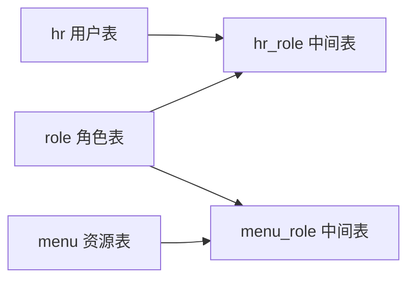
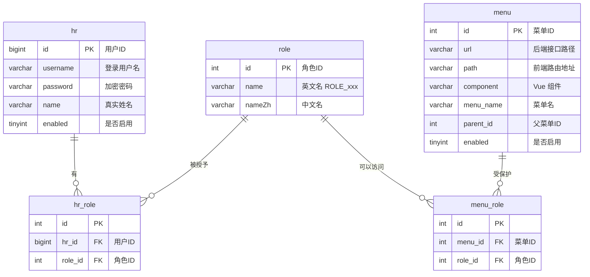
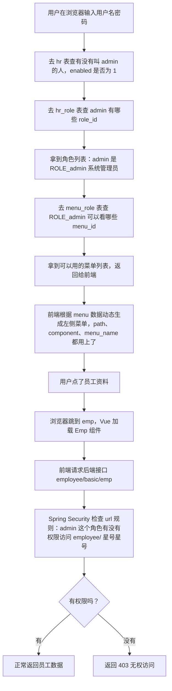

# 01.权限数据库设计

## 一句话说清这套系统

**一个人（hr）可以有多个身份（role），不同身份可以看不同的菜单和接口（menu）。**

比如：你是"系统管理员" → 你能看所有菜单；你只是"普通员工" → 你只能看自己的信息。

---

## 五张表是怎么配合的

**先看宏观关系（谁和谁关联）：**

**再看 ER 图（每张表的字段 + 表之间怎么连的）：**

一共 5 张表，分成两组：

| 组 | 表 | 作用 | 举个例子 |
|:--|:--|:--|:--|
| **左边：人有什么身份** | hr（用户表） | 谁可以登录这个系统 | 张三、李四 |
| | hr_role（中间表） | 哪个用户属于哪个角色 | 张三 → 管理员 |
| | role（角色表） | 有哪些身份 | 管理员、人事、员工 |
| **右边：身份能看什么** | menu（资源表） | 系统里有哪些菜单/接口 | 员工管理、部门管理 |
| | menu_role（中间表） | 哪个角色可以访问哪个资源 | 管理员 → 可以用部门管理接口 |

> 💡 **为什么要有中间表？**
> >
> > 假设你想把"张三有哪些角色"直接写在 hr 表里，你可能会这么干：
> >
> > **❌ 错误写法：在 hr 表里写 role_id（一个用户有多个角色就写不下）**
> >
> > | username | role_id |
> > |:--|:--|
> > | admin | 1, 2 | ← 这里写了两个角色ID，用逗号分开
> >
> > 问题很大：①数据库没法直接查"角色2有哪些用户"，②要加新角色时得去拆字符串，③统计"有多少人是管理员"很麻烦。
> >
> > **✅ 正确写法：用中间表，每个"用户-角色"组合单独一行**
> >
> > **hr_role 表：**
> >
> > | hr_id | role_id |
> > |:--|:--|
> > | 1 | 1 | ← 用户1 有 角色1 |
> > | 1 | 2 | ← 用户1 还有 角色2 |
> > | 2 | 2 | ← 用户2 有 角色2 |
> >
> > 想查"admin 有哪些角色"？查 hr_id=1 的所有行 → 拿到 role_id 1 和 2。
> > 想查"角色2有哪些用户"？查 role_id=2 的所有行 → 拿到 hr_id 1 和 2。
> > 中间表就是干这件事的：**把"多对多"的关系拆成"一对多"来处理**。
> >
> > menu_role 表的逻辑一模一样，只是换成了"角色和菜单"的关系。

---

## 每张表的核心字段

你不需要记住所有字段，每张表只看 3~4 个最关键的就行。

### hr 表：谁可以登录

| 字段 | 是什么 | 举个例子 |
|:--|:--|:--|
| **username** | 登录用户名 | `admin` |
| **password** | 加密后的密码（不是明文！） | `$2a$10$yROe...` |
| **name** | 这个人的真实名字 | `系统管理员` |
| **enabled** | 账号有没有被禁用，1=启用 | `1` |

### role 表：有哪些身份

| 字段 | 是什么 | 举个例子 |
|:--|:--|:--|
| **name** | 角色的英文名（Spring Security 要求必须 `ROLE_` 开头） | `ROLE_admin` |
| **nameZh** | 角色的中文名（给人看的） | `系统管理员` |

### menu 表：有哪些菜单和接口

| 字段 | 是什么 | 举个例子 |
|:--|:--|:--|
| **url** | 后端接口路径（权限系统靠它判断"能不能访问"） | `/system/basic/**` |
| **path** | 前端路由地址（前端浏览器地址栏的东西） | `/system/basic` |
| **component** | 对应哪个 Vue 组件 | `emp/Emp` |
| **menu_name** | 菜单叫什么名字 | `员工资料` |
| **parent_id** | 属于哪个父菜单（做树状菜单用的） | `3` |
| **enabled** | 这个菜单要不要显示 | `1` |

> **url 和 path 的区别是什么？** `url` 是后端的（告诉 Spring Security 哪些接口要拦截），`path` 是前端的（告诉 Vue 浏览器地址栏跳哪去）。一个菜单同时有这两个，这是前后端分离项目的特点。

### hr_role 表：哪个用户有哪些角色

| 字段 | 是什么 | 举个例子 |
|:--|:--|:--|
| **hr_id** | 用户的 ID（来自 hr 表的 id） | `1` |
| **role_id** | 角色的 ID（来自 role 表的 id） | `1` |

一行就表示："ID=1 的用户 有 ID=1 的角色"。

### menu_role 表：哪个角色能看哪些菜单

| 字段 | 是什么 | 举个例子 |
|:--|:--|:--|
| **menu_id** | 资源/菜单的 ID（来自 menu 表的 id） | `5` |
| **role_id** | 角色的 ID（来自 role 表的 id） | `1` |

一行就表示："ID=1 的角色 可以访问 ID=5 的菜单"。

---

## 真实例子：admin 登录时发生了什么

顺着这个流程，你再回头看上面五张表的字段，应该就知道每个字段是干嘛用的了。

---

## 下一步

这套表结构和示例数据都在项目里的 **`resources/vhr.sql`** 中。
**继续读 `02.Docker启动MySQL并导入数据.md`**，里面会教你怎么把这个 SQL 文件导入 MySQL，让数据库真正有这些表和数据。
