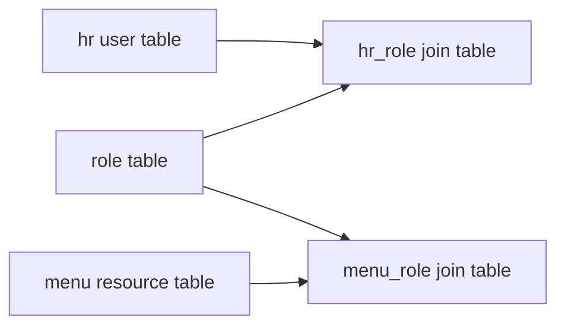
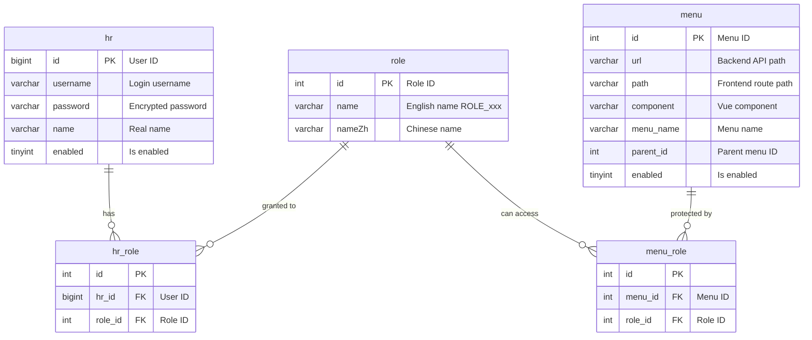
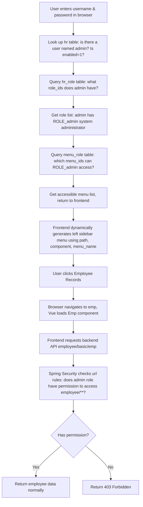

# 01. Permission Database Design

## The System in One Sentence

**A user (hr) can have multiple roles (role), and different roles can access different menus and API endpoints (menu).**

For example: you are a "system admin" → you can see all menus; you are just a "regular employee" → you can only see your own info.

---

## How the Five Tables Work Together

**First, the macro relationships (who connects to whom):**

**Then the ER diagram (fields per table + how tables connect):**

Five tables total, split into two groups:

| Group | Table | Purpose | Example |
|:--|:--|:--|:--|
| **Left side: who has what identity** | hr (user table) | Who can log in | Zhang San, Li Si |
| | hr_role (join table) | Which user belongs to which role | Zhang San → admin |
| | role (role table) | What identities exist | admin, HR, employee |
| **Right side: what can each identity see** | menu (resource table) | What menus/APIs exist | Employee management, Department management |
| | menu_role (join table) | Which role can access which resource | admin → can use department management API |

> **Why join tables?**
>
> Suppose you want to store "which roles does Zhang San have" directly in the hr table. You might try:
>
> **Wrong approach: store role_id in the hr table (can't handle multiple roles)**
>
> | username | role_id |
> |:--|:--|
> | admin | 1, 2 | ← two role IDs separated by commas
>
> Big problems: ① the database can't directly query "which users have role 2", ② you'd have to split strings to add new roles, ③ counting "how many admins" is painful.
>
> **Correct approach: use a join table, one row per user-role pair**
>
> **hr_role table:**
>
> | hr_id | role_id |
> |:--|:--|
> | 1 | 1 | ← user 1 has role 1 |
> | 1 | 2 | ← user 1 also has role 2 |
> | 2 | 2 | ← user 2 has role 2 |
>
> Want to know "which roles does admin have"? Query all rows where hr_id=1 → get role_id 1 and 2.
> Want to know "which users have role 2"? Query all rows where role_id=2 → get hr_id 1 and 2.
> Join tables do exactly this: **break a many-to-many relationship into one-to-many relationships**.
>
> The menu_role table works the exact same way, just for roles and menus.

---

## Key Fields Per Table

You don't need to memorize every field. Just focus on 3–4 critical ones per table.

### hr table: who can log in

| Field | What it is | Example |
|:--|:--|:--|
| **username** | Login username | `admin` |
| **password** | Encrypted password (never plaintext!) | `$2a$10$yROe...` |
| **name** | The person's real name | `System Admin` |
| **enabled** | Whether the account is disabled, 1=enabled | `1` |

### role table: what identities exist

| Field | What it is | Example |
|:--|:--|:--|
| **name** | Role's English name (Spring Security requires `ROLE_` prefix) | `ROLE_admin` |
| **nameZh** | Role's Chinese name (for humans) | `System Admin` |

### menu table: what menus and APIs exist

| Field | What it is | Example |
|:--|:--|:--|
| **url** | Backend API path (the permission system uses this to decide "can access?") | `/system/basic/**` |
| **path** | Frontend route path (what appears in the browser address bar) | `/system/basic` |
| **component** | Which Vue component it maps to | `emp/Emp` |
| **menu_name** | What the menu is called | `Employee Records` |
| **parent_id** | Which parent menu it belongs to (for tree menus) | `3` |
| **enabled** | Whether this menu should be shown | `1` |

> **What's the difference between url and path?** `url` is backend (tells Spring Security which APIs to intercept), `path` is frontend (tells Vue where to navigate in the browser). A menu has both — this is characteristic of a frontend-backend separated project.

### hr_role table: which user has which roles

| Field | What it is | Example |
|:--|:--|:--|
| **hr_id** | User's ID (from hr table's id) | `1` |
| **role_id** | Role's ID (from role table's id) | `1` |

One row means: "user with ID=1 has role with ID=1".

### menu_role table: which role can see which menus

| Field | What it is | Example |
|:--|:--|:--|
| **menu_id** | Resource/menu ID (from menu table's id) | `5` |
| **role_id** | Role's ID (from role table's id) | `1` |

One row means: "role with ID=1 can access menu with ID=5".

---

## Real Example: What Happens When admin Logs In

Follow this flow and then look back at the five tables' fields — you should now understand what each field is for.

---

## Next Step

The table structure and sample data are in **`resources/vhr.sql`** in the project.
**Continue reading [`02.Docker-MySQL-Setup-and-Data-Import.md`](02.Docker-MySQL-Setup-and-Data-Import.md)**, which teaches you how to import this SQL file into MySQL so the database actually has these tables and data.
